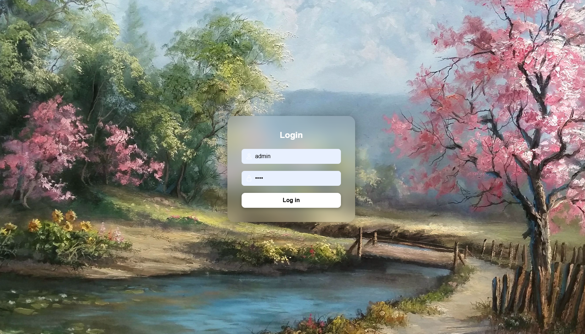
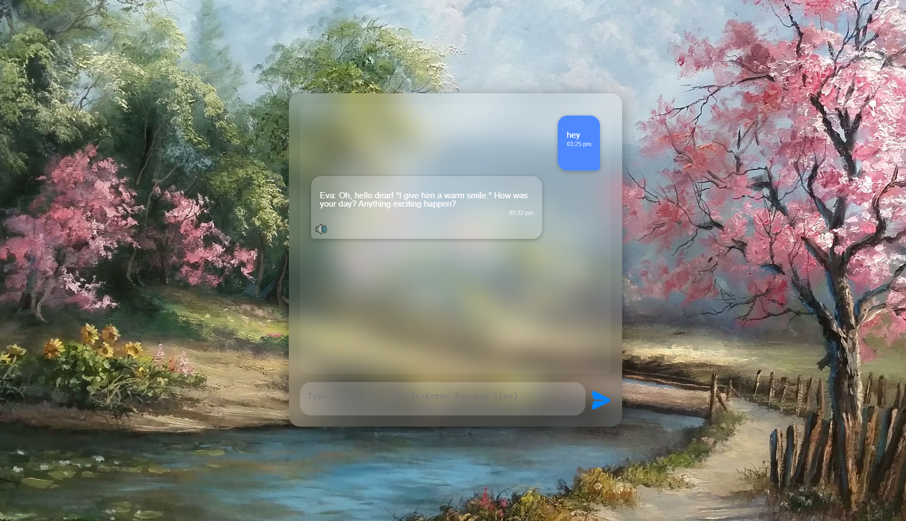

# 💬 Eva

Eva is a personalized AI chatbot designed to behave as you want with the given system prompt. Powered by a local LLM (e.g. Nyanade Stunna Maid 7B via LlamaCpp) and enhanced with natural speech synthesis via [Kokoro's `KPipeline`](https://github.com/kokoro-ai/kpipeline), Eva remembers conversations, speaks her replies, and interacts in a warm, affectionate, and human-like way.

This app features a modern **glassmorphic UI**, **secure login**, **voice response generation**, and **session-based memory** — running entirely locally.

---
## 📸 Screenshots

### 🔐 Login Screen


### 💬 Chat Interface

## 🌟 Features

* 🧠 **LLM-Powered Chat**: Uses a locally running LLM (LlamaCpp + LangChain) to generate romantic, supportive, and emotionally deep responses.
* 🕰️ **Time-Aware Responses**: Eva knows the current time and adapts her mood and replies accordingly (e.g. good morning/night messages).
* 🔐 **Login System**: Basic username/password login with session handling via Flask.
* 💬 **Glassmorphic UI**: Sleek chat interface with blurred backgrounds, glowing buttons, and styled chat bubbles.
* 🔊 **Voice Synthesis**: Generates voice using `KPipeline` and speaks only when you click the 🔊 play button.
* 💽 **Cached Audio Playback**: Generated voice clips are saved in `/generated_audio` to avoid regeneration.
* 🧹 **Startup Cleanup**: The `generated_audio/` folder is wiped clean every time the app restarts.

---

## 🚀 Getting Started

### 📦 Requirements

* Python 3.10+
* [KPipeline](https://github.com/kokoro-ai/kpipeline)
* LlamaCpp with a compatible `.gguf` model
* Other dependencies:

  ```bash
  pip install flask soundfile langchain
  ```

### 🔧 Directory Structure

```
your_project/
├── app.py
├── generated_audio/          # auto-created and cleaned on startup
├── maiscr/
│   └── chat_history.json     # stores past conversations
├── static/
│   ├── style.css
│   ├── bg.jpg                # background image
│   └── send.png              # send button icon
├── templates/
│   ├── index.html            # login page
│   └── dashboard.html        # chat interface
```

---

## ⚙️ Configuration

### 🔑 Login

Change the hardcoded credentials in `app.py`:

```python
VALID_USERNAME = "admin"
VALID_PASSWORD = "1234"
```

You can extend this to support user files or hashed passwords if needed.

### 🗣️ Voice Customization

In `generate_audio_file()` inside `app.py`, you can change:

```python
voice='af_heart'   # or try 'af_sweet', 'af_calm', etc.
speed=0.7          # slower is more romantic
```

### 🧠 Model Path

Update your `.gguf` model path here:

```python
model_path=os.path.join("maiscr", "Nyanade_Stunna-Maid-7B-v0.2-Q4_K_M-imat.gguf")
```

Make sure the model is compatible with LlamaCpp.

---

## 💻 Usage

1. **Run the app**:

   ```bash
   python app.py
   ```

2. Open your browser and go to:

   ```
   http://localhost:5000
   ```

3. Log in and start chatting with Eva.
   Click the 🔊 button in the bottom-left of her messages to hear her voice.

---

## 🧼 Auto Cleanup

On every restart:

* All `.wav` files in `generated_audio/` are deleted
* The chatbot keeps memory using `chat_history.json`

You can clear memory manually by deleting that file.

---


## ❤️ Credits

* 💻 Built with [LangChain](https://www.langchain.com/), [LlamaCpp](https://github.com/ggerganov/llama.cpp)
* 🎤 Voice by [Kokoro AI](https://github.com/kokoro-ai/kpipeline)
* ✨ UI handcrafted by Quarks with 💖

---

## 📃 License

This is a personal project. Use, modify, and expand it as you like.pls give me the screen shots or ideas if you do so at duttaasmit3@gmail.com
For commercial use or redistribution, please credit the original model creators and Kokoro.

---

Let me know if you'd like me to:

* Generate a sample `requirements.txt`
* Package this into a `.zip`
* Help you deploy it with `ngrok` or `localtunnel` for sharing online!
